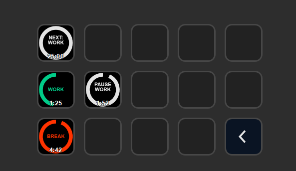

# Stream Deck Tomato Timer

A configurable timer for practicing the [Pomodoro Technique](https://en.wikipedia.org/wiki/Pomodoro_Technique) for balancing work and break times. 

# Features

- Configurable work, short and long break durations
- Use one of 3 built-in alarm clock sounds or select an mp3 of your own
- 7 color palette swap themes
- cross-platform (macOS, Windows)

# How-To

- Decide on what to do
- Press the button to start the work timer (25 minutes)</li>
- Work until the timer expires. Press the button to turn off the alarm</li>
- Press the button again and take a short break (5 minutes)</li>
- Repeat this process 3 more times, then</li>
- Take a long break (25 minutes)</li>

You can pause the timer at any time with a short press to pause and later resume. Pressing and holding for 2 seconds ends the current phase and moves to the next one.

Note: This action times things differently than the standard Pomodoro method; the fourth break is one long break interval instead of a short break into a long break. 

# Installation

In the Release folder, you can find the file `com.gallowaylabs.tomato.sdPlugin`. If you double-click this file on your machine, Stream Deck will install the plugin. 
If you don't have the repository downloaded, get the latest pre-built version on the [releases page](https://github.com/gallowaylabs/streamdeck-tomato-timer/releases)
